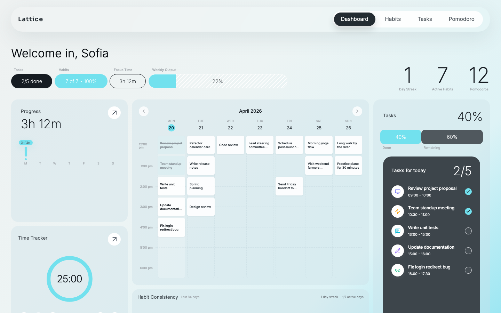

# Lattice

Lattice is a productivity dashboard built with React and TypeScript. It combines task management, habit tracking, a Pomodoro timer, and a dashboard that shows everything in one place.

<p align="center">
  
</p>

## Quality

| Metric                 | Score |
| ---------------------- | ----- |
| Lighthouse Performance | 99    |
| Accessibility          | 96    |
| SEO                    | 100   |

## Features

- Dashboard with a quick overview of tasks, habits, focus time, streaks, and weekly progress
- Task management with create, edit, complete, and organize flows
- Habit tracking with weekly progress and consistency views
- Pomodoro timer with work and break sessions
- Calendar and summary cards for daily and weekly planning
- Local persistence using IndexedDB and browser storage

## Pages

- `/dashboard` or `/` - main overview page
- `/tasks` - task list and task actions
- `/habit-tracker` - habit tracking page
- `/pomodoro` - focus timer page

## Tech Stack

- React 18
- TypeScript
- Vite
- React Router
- Tailwind CSS
- Dexie / IndexedDB
- React Hook Form
- Zod
- Vitest

## Getting Started

### Requirements

- Node.js 18 or newer
- npm

### Run the project

```bash
npm install
npm run dev
```

The app will usually be available at `http://localhost:5173`.

## Available Scripts

```bash
npm run dev
npm run build
npm run preview
npm run typecheck
npm run lint
npm run test
npm run test:run
npm run test:coverage
```

## Project Structure

```text
src/
├── components/   UI and feature components
├── context/      React context providers
├── db/           IndexedDB setup and data seeding
├── hooks/        Reusable logic
├── lib/          Utilities and helpers
├── pages/        Route-level pages
└── types/        Shared TypeScript types
```
